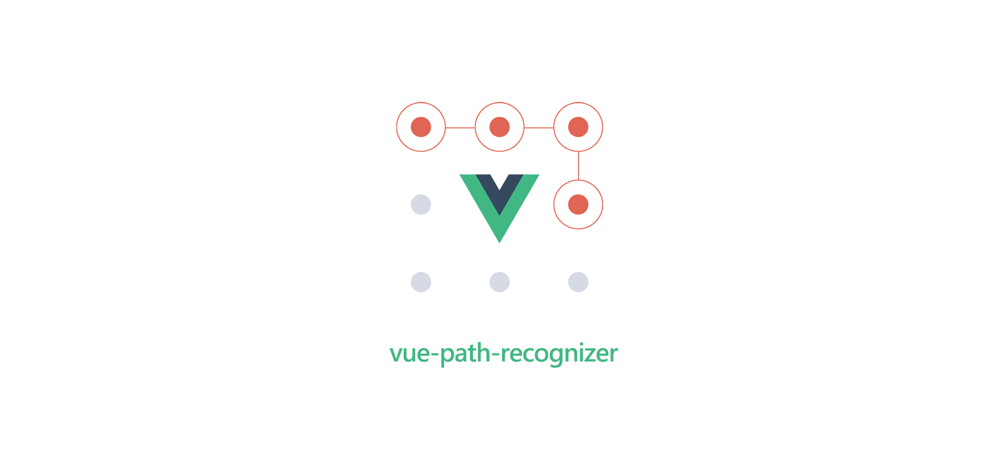

<p align=center>Path recognizing component for Vue</p>
<p align=center>
    <a target="_blank" href="https://vuejs.org/" title="vue">
        
    </a>
    <a target="_blank" href="http://nodejs.org/download/" title="Node version">
        
    </a>
    <a target="_blank" href="https://github.com/MikeCheng1208/Vue-path-recognizer/pulls" title="PRs Welcome">
        
    </a>
</p>

[](https://www.npmjs.com/package/vue-path-recognizer)

## Demo


## Installation
```bash
npm install vue-path-recognizer --save
```

## Basic usage

Import the PathRecongizer component. PathRecognizer is a container, it requires a child element to capture mouse moves. PathRecognizer does not draw the moves, for a full drawing example, check the example/ folder of this repo.

```js
import PathRecognizer, { PathRecognizerModel } from 'vue-path-recognizer';

export default {
  components: {
    PathRecognizer,
  },
  data() {
    return {
      context: null,
      result: "",
      models: [
        new PathRecognizerModel([7, 1], "A"),
        new PathRecognizerModel([2, 6, 0, 1, 2, 3, 4, 0, 1, 2, 3, 4], "B"),
        new PathRecognizerModel([4, 3, 2, 1, 0], "C"),
      ]
    }
  }
}
```
Add some path model to the recognizer.
Each path is defined by a direction-sequence and an associated data object.

```js
models: [
  new PathRecognizerModel([7, 1], "A"),
  new PathRecognizerModel([2,6,0,1,2,3,4,0,1,2,3,4], "B"),
  new PathRecognizerModel([4,3,2,1,0], "C"),
  new PathRecognizerModel([2,6,7,0,1,2,3,4], "D"),
  new PathRecognizerModel([4,3,2,1,0,4,3,2,1,0], "E")
}
```
Wrap your sliding template range
```html

<path-recognizer
  :models="models"
  :onGesture="handleGesture"
  :onStartDraw="handleStartDraw"
  :onMovePath="handleMovePath"
>
  <template v-slot:default="props">
    <div 
      @mousedown="props.onMouseDown"
      @mouseup="props.onMouseUp"
    >
    </div>
  </template>
</path-recognizer>

```

For example, here the model for the letter E :


Set the models and the onGesture prop on the PathRecognizer component :

```html
  <path-recognizer
    :models="models"
    :onGesture="handleGesture"
    :onStartDraw="handleStartDraw"
    :onMovePath="handleMovePath"
  >
  </path-recognizer>
```

Note that onGesture({datas}) is always invoked at the end of the drawing. If no gesture is recognized, this parametter is null.

## Custom filter
While adding a model, you can specify a custom filter (third parametter of PathRecognizerModel). The filter callback method, if specified, will let you a last chance to modify / analyze the datas to determine a new score.

For example, the letter D & P have a similar draw-direction-path, however you can discriminate each one by detecting the position of the last point (up -> it's a P, down -> it's a D). The PathInfos struct transmited to the filter function will help you to determine the new score.

```js
 filter(infos, model){
    let lastPoint
    switch (model.datas){
      case "P":
        lastPoint = [...infos.deltaPoints].pop()
        if (lastPoint.y > infos.boundingBox.top + infos.boundingBox.height * 0.6) return Number.POSITIVE_INFINITY
        return infos.cost
      case "D":
        lastPoint = [...infos.deltaPoints].pop()
        if (lastPoint.y < infos.boundingBox.top + infos.boundingBox.height * 0.6) return Number.POSITIVE_INFINITY
        return infos.cost
   }
}
```

For a full example, please consult the example folder of this repo.

## API

### PathRecognizer props

<table class="table table-bordered table-striped">
    <thead>
    <tr>
        <th style="width: 100px;">name</th>
        <th style="width: 50px;">type</th>
        <th style="width: 50px;">default</th>
        <th>description</th>
    </tr>
    </thead>
    <tbody>
        <tr>
          <td>sliceCount</td>
          <td>Number</td>
          <td>8</td>
          <td>Resolution of the direction wheel</td>
        </tr>
        <tr>
          <td>deltaMove</td>
          <td>Number</td>
          <td>8</td>
          <td>Mouse move threshold (pixels)</td>
        </tr>
        <tr>
          <td>costMax</td>
          <td>Number</td>
          <td>32</td>
          <td>Max cost limit to detect a gesture</td>
        </tr>
        <tr>
          <td>models</td>
          <td>[PathRecognizerModel([Number], Any)]</td>
          <td>[]</td>
          <td>Models to recognize</td>
        </tr>
        <tr>
          <td>onStartDraw</td>
          <td>Function()</td>
          <td>function</td>
          <td>Invoked when the user mouse down the zone</td>
        </tr>
        <tr>
          <td>onMovePath</td>
          <td>Function([{x:Number, y:Number}])</td>
          <td>function</td>
          <td>Invoked when the user move his mouse during a record session</td>
        </tr>
       <tr>
          <td>onStopDraw</td>
          <td>Function()</td>
          <td>function</td>
          <td>Invoked when the user mouse up the zone</td>
        </tr>
        <tr>
          <td>onGesture</td>
          <td>Function(datas:Any)</td>
          <td>function</td>
          <td>Invoked with the datas of the model recognized or null if no gesture is recognized</td>
        </tr>
    </tbody>
 </table>

## Free path

In this sample project I've used the Graffiti alphabet for the didactic aspect. However, react-path-recognizer is a generic algorithm, you can add any free path to control an interface / game :


## References & Original Authors
[Didier Brun](https://github.com/didierbrun)
<br/>
<br/>
## License
MIT © [MikeCheng1208](https://github.com/MikeCheng1208)
